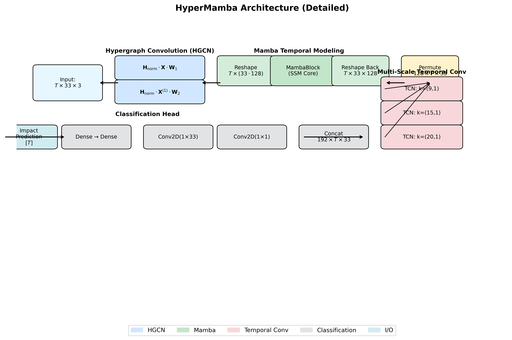

# FLASH: Efficient Impact Fall Detection with Unified Hypergraph State-Space Model

<div align="center">

[](https://icip2026.exordo.com)
[](LICENSE)


</div>

---

> **FLASH** is a novel framework for **impact fall detection** that pinpoints the
> precise ground-impact moment from skeleton sequences. It integrates
> **single-matrix biomechanically-grounded hypergraphs** for spatial modeling
> with **Mamba's selective state-space models** for efficient temporal modeling.

📄 **Paper accepted at IEEE International Conference on Image Processing (ICIP 2026)**  
📅 September 13–17, 2026 — Tampere, Finland

---

## 🔍 Overview

Falls represent a critical public health challenge. FLASH addresses the precise
detection of the **impact moment** — the instant the body hits the ground —
which is crucial for timely medical intervention.

### Key contributions:
- **Single-matrix hypergraph** representation encoding multi-joint coordination
  while avoiding dual-incidence redundancy
- **Mamba SSM integration** achieving linear-time temporal modeling vs.
  transformers' quadratic complexity
- **71.3% FLOPs reduction** and **93.9% faster inference** compared to
  dual-representation methods
- **Interpretable feedback** through learned joint attention patterns aligned
  with biomechanical principles

---

## 📊 Results

### Performance on UP-Fall Dataset
| Method | Hypergraph | Acc (%) | F1 (%) | Impact Detection |
|--------|-----------|---------|--------|-----------------|
| ST-GCN | No | 92.16 | 91.31 | No |
| 2s-AGCN | No | 95.10 | -- | No |
| Hyper-GNN | Yes (adaptive) | 89.50 | 95.19 | No |
| Transformer | No | 93.15 | 93.80 | No |
| DistillH-Mamba | Yes (dual + KD) | 97.38 | 97.51 | Yes |
| **FLASH (Ours)** | **Yes (single)** | **95.13** | **95.52** | **Yes** |

### Zero-Shot Cross-Dataset Generalization
| Train | Test | Acc (%) | F1 (%) | AUC (%) |
|-------|------|---------|--------|---------|
| UP-Fall | UMAFall (zero-shot) | 95.83 | 96.15 | 98.98 |
| UMAFall | UMAFall (in-domain) | 97.92 | 97.70 | 99.15 |

### Computational Efficiency
| Model | Memory (MB) | Params (M) | FLOPs (×10⁷) | Time (ms) |
|-------|------------|-----------|--------------|-----------|
| DistillH-Mamba (Dual+KD) | 280.46 | 70.12 | 2.266 | 182.3 |
| Transformer | 341.6 | 85.4 | 4.523 | 245.6 |
| **FLASH (Ours)** | **148.4** | **37.1** | **0.65** | **11.2** |

### Hyperedge Ablation Study
| Configuration | Accuracy (%) | Drop (pp) |
|--------------|-------------|-----------|
| Full Model (6 hyperedges) | 95.13 | — |
| Remove Legs (L+R) | 92.15 | 2.98 |
| Remove Torso | 93.02 | 2.11 |
| Remove Arms (L+R) | 93.80 | 1.33 |

### Occlusion Robustness
| Joint Dropout | Accuracy (%) | Drop (pp) |
|--------------|-------------|-----------|
| 0% (Baseline) | 95.13 | — |
| 10% | 94.84 | 0.29 |
| 20% | 94.50 | 0.63 |
| 30% | 93.75 | 1.38 |

---

## 🏗️ Architecture

FLASH consists of four stages:
1. **Input** — 3D skeleton sequence with 33 joints per frame
2. **HGCN** — 2-layer hypergraph convolution with 6 biomechanical hyperedges
3. **Mamba Block** — Selective SSM with O(T) complexity for temporal modeling
4. **MTCN** — Multi-scale temporal convolutions (kernels 9, 15, 20) + FC classifier



---

## 📦 Installation

```bash
git clone https://github.com/Tresor-Koffi/FLASH-Impact-Fall-Detection.git
cd FLASH-Impact-Fall-Detection
pip install -r requirements.txt
```

---

## 📁 Project Structure

```
FLASH/
├── HGCN/
│   ├── hmamba.py              # Main FLASH model (HGCN + Mamba + MTCN)
│   ├── hypergraph.py          # Hypergraph construction (J=33, E=6)
│   ├── hypergraph_ablation.py # Hyperedge ablation variants
│   ├── data_processing.py     # Data loading and preprocessing
│   └── test_occlusion.py      # Occlusion robustness module
├── pretrain_model/            # Pretrained model utilities
├── train.py                   # Main training script
├── train_ablation.py          # Hyperedge ablation study
├── test_occlusion.py          # Occlusion robustness evaluation
├── run.py                     # Easy entry point ← START HERE
├── plot_hypermamba_arch.py    # Architecture visualization
└── requirements.txt           # Python dependencies
```
---

## 🚀 How to Run

### Step 1 — Dataset Setup
Download and place datasets in a `Data/` folder:
- **UP-Fall**: https://sites.google.com/up.edu.mx/har-up/ ( Train_X.csv and Train_Y.csv)
- **UMAFall**: https://figshare.com/articles/dataset/UMAFall/4214283
```
Data/
├── Train_X.csv
├── Train_Y.csv
└── UMFALL/
    ├── UB/
    ├── UFF/
    └── UFL/
```
### Step 2 — Run experiments

#### Option A — Easy mode with run.py ✅ Recommended

```bash
# Train FLASH (full 300 epochs)
python run.py --mode train

# Quick test (5 epochs only)
python run.py --mode train --epochs 5

# Run hyperedge ablation study
python run.py --mode ablation

# Test occlusion robustness
python run.py --mode occlusion

# Run ALL experiments at once
python run.py --mode all

# See all available options
python run.py --help
```

#### Option B — Run each script individually

| Script | What it does | Command |
|--------|-------------|---------|
| `train.py` | Trains FLASH on UP-Fall dataset and evaluates on test set. Saves best model to `saved_models/` | `python train.py --epochs 300 --batch_size 32 --lr 1e-4` |
| `train_ablation.py` | Systematically removes each hyperedge group (legs, torso, arms) and measures accuracy drop. Saves results to `ablation_results.json` | `python train_ablation.py` |
| `test_occlusion.py` | Evaluates FLASH with 10%, 20%, 30% of joints randomly missing to simulate real-world camera occlusion | `python test_occlusion.py` |
| `plot_hypermamba_arch.py` | Generates a detailed visualization of the FLASH architecture diagram | `python plot_hypermamba_arch.py` |

#### Option C — Custom training parameters

```bash
python train.py \
  --epochs 300 \
  --batch_size 32 \
  --lr 1e-4 \
  --weight_decay 1e-5
```

---

## 📖 Citation

If you find this work useful, please cite:

```bibtex
@inproceedings{koffi2026flash,
  title     = {FLASH: Efficient Impact Fall Detection with
               Unified Hypergraph State-Space Model},
  author    = {Koffi, Tresor Y. and Mourchid, Youssef
               and Dupuis, Yohan},
  booktitle = {IEEE International Conference on Image
               Processing (ICIP)},
  year      = {2026},
  address   = {Tampere, Finland}
}
```

---

## 📬 Contact

**Tresor Y. Koffi** — ytkoffi@cesi.fr  
**Youssef Mourchid** — ymourchid@cesi.fr  
**Yohan Dupuis** — ydupuis@cesi.fr  
CESI LINEACT, France